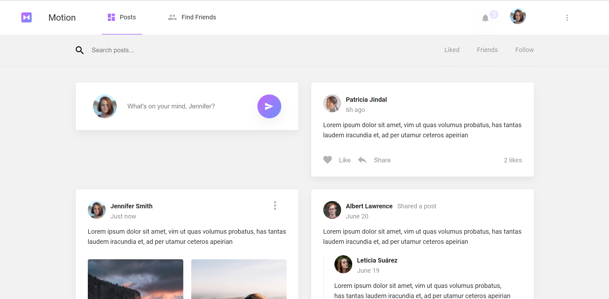
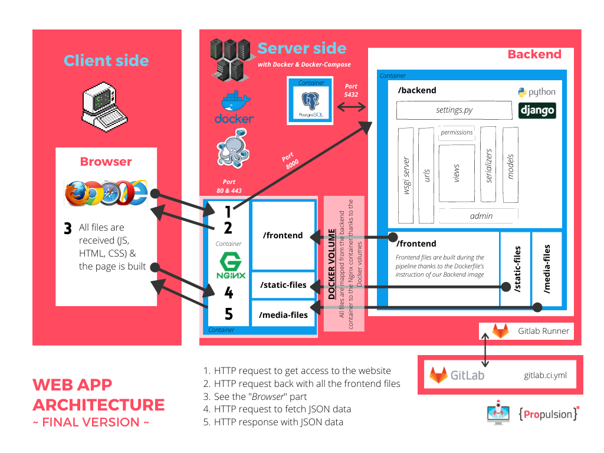

# Impressions

# Purpose
Project Motion is the result of a 3 week sprint of solo web development. 
The web app's purpose is to provide a platform for social interactions and networking. 
Like Facebook. Not really different but fun to develop. 
With features as registration, login, posts and comments it lets users connect to each other around the globe. 
In it's current state, Motion provides a solid starting point in terms of database implementation (Python, Django),
DevOps (CI/CD Runner and Ubuntu server) as well as frontend pages (JavaScript ES6, React and Redux) for further development.

# Setup Guide 
<strong>Project and Frontend</strong>

1. Install node: https://nodejs.org/en/download/
2. Update npm: <code>$ sudo npm install -g npm@latest</code>
3. Install Docker: https://docs.docker.com/get-docker/
4. Clone the repository: <code>$ git clone</code>
5. Install all dependencies: <code>$ cd frontend/ $ npm i</code> 
6. Start the frontend React app: <code>$ cd frontend/ $ npm start</code>
7. Test if the React app is running correctly by accessing "http://localhost:3000/"

<strong>Backend and Docker</strong>

8. Build the docker image: <code>$ docker build -t registry_name .</code>
9. Setup PyCharm with a remote interpreter for the docker container:
* PyCharm settings > Build, Execution, Deployment > Docker > virtual path "/backend" and local path "C:\Users\MyUser\PycharmProjects\motion-deploy\backend"
* PyCharm settings > Project > Add Interpreter > Docker Compose > Service: "backend" + Python interpreter path "/opt/conda/envs/backend/bin/python"
* Make PyCharm Run/Debug configurations > 
    * Script path: "C:\Users\MyUser\PycharmProjects\motion-deploy\backend\manage.py"
    * Command: <code>runserver 0.0.0.0:8000</code>
    * Path mapping: "C:/Users/alex_/PycharmProjects/motion-deploy/backend=/backend"
* Make PyCharm Run/Debug configurations > Same as above with command <code>makemigrations</code>
* Make PyCharm Run/Debug configurations > Same as above with command <code>migrate</code>
10. Test if the server is running correctly by accessing "http://localhost:8000/admin/"

# Architecture

# Endpoints
<strong>Registration</strong>

<code>api/auth/registration/</code> POST: Register a new user by asking for an email (send email validation code)

<code>api/auth/registration/validation/</code> POST: Validate a new registered user with a validation code sent by email

<strong>Auth</strong>

<code>api/auth/token/</code> POST: Get a new JWT by passing username and password

<code>api/auth/token/refresh/</code> POST: Get a new JWT by passing an old still valid refresh token.

<code>api/auth/token/verify/</code> POST: Verify a token by passing the access token

<code>api/auth/password-reset/</code> POST: User should pass his email address and receive a validation code

<code>api/auth/password-reset/validation/</code> POST: Reset the user password - use the validation code to check that it’s the correct user

<strong>Me</strong>

<code>api/users/me/</code> GET: Get logged in user’s profile (as well as private information like email, etc.)

<code>api/users/me/</code> PATCH: Update the logged in user’s profile public info)

<strong>Posts</strong>

<code>api/social/posts/</code> POST: user can create a new post by sending post data. He should also be able to share another post. (Check out the frontend design to see how a shared post looks like frontend design)

<code>api/social/posts/</code> GET: lists all the posts of all users in chronological order

<code>api/social/posts/?search=<str:search_string></code> GET: Search posts of all users and list result in chronological order

<code>api/social/posts/<int:post_id>/</code> GET: get a specific post by ID and display all the information about that post

<code>api/social/posts/<int:post_id>/</code> PATCH: update a specific post (only allow owner of post or admin)

<code>api/social/posts/<int:post_id>/</code> DELETE: delete a post by ID (only allow owner of post or admin)

<code>api/social/posts/user/<int:user_id>/</code> GET: lists all the posts of a specific user in chronological order

<code>api/social/posts/following/</code> GET: lists all the posts of followed users in chronological order

<code>api/social/posts/friends/</code> GET: lists all the posts of the logged in user’s friends in chronological order

<code>api/social/posts/toggle-like/int:post_id>/</code> POST: Toggle like a post

<code>api/social/posts/likes/</code> GET: the list of the posts the user likes

<strong>Comments</strong>

<code>api/social/comments/<int:post_id>/</code> POST: Create a new comment on a post.

<code>api/social/comments/<int:post_id>/</code> GET: List all comments of a post

<strong>Users</strong>

<code>api/social/followers/toggle-follow/<int:user_id>/</code> POST: Toggle follow/unfollow a user

<code>api/social/followers/followers/</code> GET: List of all the logged in user’s followers

<code>api/social/followers/following/</code> GET: List of all the people the current logged in user is following

<code>api/social/friends/request/<int:user_id>/</code> POST: Send friend request to another user

<code>api/social/friends/requests/<int:friend_request_id>/</code> GET: Get details of a friend request

<code>api/social/friends/requests/<int:friend_request_id>/</code> PATCH: Accept or Reject an open friend request

<code>api/social/friends/requests/<int:friend_request_id>/</code> DELETE: Delete a friend request

<code>api/social/friends/</code> GET: List all accepted friends

<code>api/users/</code> GET: Get all the users

<code>api/users/?search=<str:search_string></code> GET: Search users

<code>api/users/<int:user_id>/</code> GET: Get specific user profile

<strong>Emails</strong>

Send an email to the user if they get followed by someone 
Send an email to the user if they get a friend request 
Send an email if a friend request gets accepted 
Send an email to the user if a friend makes a post 

# Development
* Friend feature pending
* About 80% of the endpoints are done
* Minor frontend styling needed
* Security and data leak testing pending
